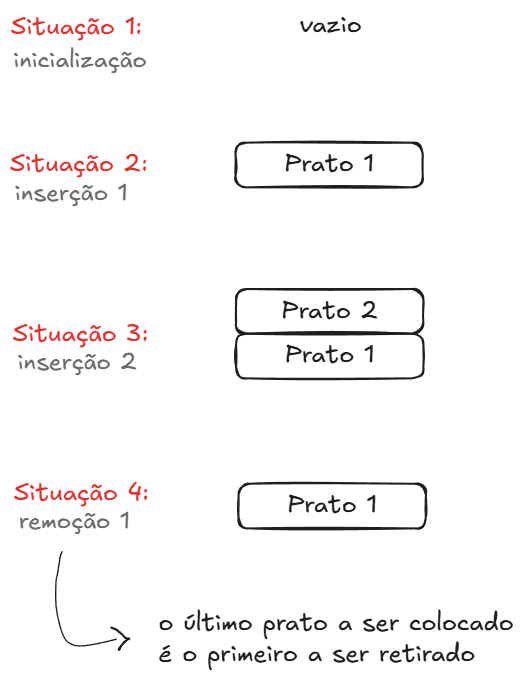

#### Sobre

Uma pilha é uma estrutura de dados do tipo **LIFO** (Last In, First Out), ou seja, o último elemento a entrar é o primeiro a sair. Como exemplo do conceito no cotidiano temos uma pilha de pratos que estão prestes a ser lavados.

A representação visual da situação seria a seguinte:



___

#### Operações principais

Algumas das operações principais feitas em pilhas são:
- Inserção 
	```pseudocodigo
	SE topo ≠ M ENTÃO
		valor := topo + 1
		P[topo] := novo-valor
	SENÃO 
		overflow
	```
	Neste caso o overflow significa uma tentativa de inserir em uma pilha cheia


- Remoção
	```pseudocodigo
	SE topo ≠ 0 ENTÃO
		valor-recuperado := P[topo]
		topo := topo - 1
	SENÃO 
		underflow
	```
	Neste caso o underflow significa uma tentativa de retirar de uma pilha vazia


As pilha são usadas geralmente em navegações no histórico do navegador, algoritmos de backtracking e avaliações de expressões.


