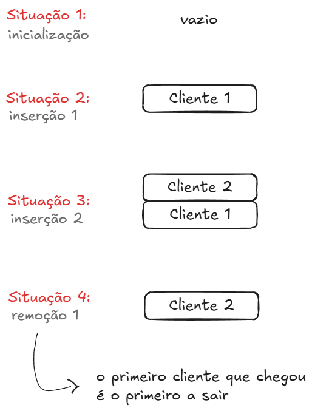

#### Sobre

Uma fila é uma estrutura de dados do tipo **FIFO** (First In, First Out), ou seja, o primeiro elemento a entrar é o primeiro a sair. Diante disso, temos o exemplo de filas de bancos, ou qualquer estabelecimento.

A representação visual dessa situação seria a seguinte:



___

#### Operações principais

Algumas das operações principais de filas são as seguintes:

- Inserção:
	```pseudocodigo
	prov := r mod M + 1
	SE prov ≠ f ENTÃO
		r := prov
		F[r] := novo-valor
		SE f = 0 ENTÃO
			f := 1
	SENÃO overflow
	```

- Remoção