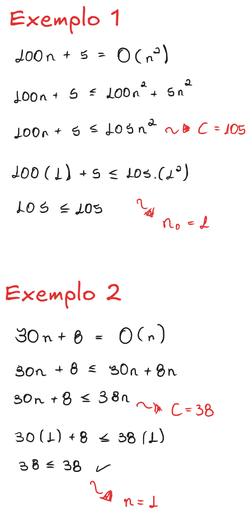

#### Sobre

As notações assintóticas são formas de analisar e expressar a eficiência de algoritmos, especialmente em termos de tempo de execução e uso de memória, à medida que o tamanho da entrada cresce (geralmente representado por n).

Vantagens das notações assintóticas:
- Analisam o algoritmo em si, e não o desempenho da máquina.
- Mostra como o algoritmo se comporta para entradas muito grandes.
- Permite comparar algoritmos de forma teórica e precisa.

##### Principais Notações Assintóticas

Você pode estudar melhor sobre os tipos de análise de casos em: [[Complexidade de Algoritmos]]

###### Big O (O-grande)

Esse é uma análise de <mark style="background: #D2B3FFA6;">Pior caso</mark>, onde representa o tempo máximo que um algoritmo pode levar. Também podemos definir como "menor que".

Como definição matemática, temos que O(g(n)) = {f(n): existem constantes positivas c e $n_0$ tais que 0 $\leq$ f(n) $\leq$ cg(n) para todo n $\geq$ $n_0$}

- Exemplo 1: Prove que 100n + 5 = O(n²)
- Exemplo 2: Prove que 30n + 8 = O(n)

###### Ω (Ômega)

Esse é uma análise de <mark style="background: #D2B3FFA6;">Melhor caso</mark>, onde representa o tempo mínimo que um algoritmo pode levar. Também podemos definir como "maior que".

Como definição matemática, temos que Ω(g(n)) = {f(n): existem constantes positivas $c$ e $n_0$ tais que 0 $\leq$ cg(n) $\leq$ f(n) para todo n $\geq$ $n_0$}.

###### Θ (Teta)

Esse é uma análise de <mark style="background: #D2B3FFA6;">Caso médio</mark>, onde representa o comportamento típico ou médio do algoritmo. Também podemos definir como "igualdade".