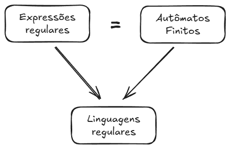

#### Sobre

As expressões regulares (regular expressions) oferecem uma forma declarativa de expressar padrões de strings que queremos aceitar.

Exemplo de expressão regular:
- 01* + 10*

Elas são parecidas com sintaxes de programação, e usadas geralmente em ambientes Unix, como:
- bash shell
- grep
- vi e outros editores
- sed

Além disso também são utilizadas em linguagens como Perl e ferramentas como Lex ou Flex (analisadores léxicos).

Já Os autômatos finitos são mais parecidos com máquinas no funcionamento. Ou seja, funcionam como um modelo computacional que lê uma entrada símbolo por símbolo e muda de estado com base em regras.

Você pode consultar mais sobre em [[2. Autômatos Finitos]].




---

#### Operadores de Linguagens


1. União de Linguagens:
	- Notação L ∪ M
	- Conjunto de todas as strings que estão em L, em M, ou em ambos.
	- A união de duas linguagens resulta em uma nova linguagem

2. Concatenação de Linguagens:
	- Notação L . M (ou apenas LM)
	- Conjunto de todas as strings que podem ser formadas pela concatenação de uma string $x$ de L com uma string $y$ de M.
	- Em outras palavras: todas as strings no formato xy, onde:
		- x ∈ L
		- y ∈ M
	- O ponto (.) geralmente é omitido

Como exemplo temos `L = {"a", "b"}` e `M = {"x", "y"}`, então:

- União de Linguagens
```text
L ∪ M = { "a", "b", "x", "y" }
```
Ou seja, **todas as strings** que estão em `L` **ou** em `M`.

- Concatenação de Linguagens
```text
LM = { "ax", "ay", "bx", "by" }
```
Ou seja, você **combina cada string de L com cada string de M**.

- `"a"` com `"x"` → `"ax"`
- `"a"` com `"y"` → `"ay"`
- `"b"` com `"x"` → `"bx"`
- `"b"` com `"y"` → `"by"`


___
#### Kleene Closure com Notas Speciais

Dado um conjunto de strings (linguagem) L, o Kleene Closure L* é definido como:

$L∗ =\ _{i=0}⋃^∞​L^i$

Inclui: