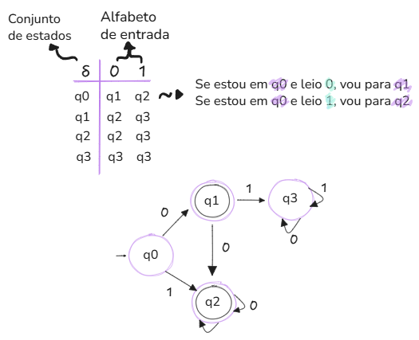

#### Sobre

Os Automatos Finitos são modelos formais de "computadores/programas" simples de descrever, mas capazes de resolver vários problemas teóricos e com algumas aplicações práticas. Um autômato tem como entrada uma palavra que é processada símbolo a símbolo até que termina num certo estado. Ele pode ser representado por um grafo orientado, onde os vértices são os estados e as arestas indicam como são lidos os símbolos.

Algumas aplicações de máquinas automatas finitas:
- Softwares para desenhar e checar comportamentos de circuitos digitais
- Analisadores léxicos de compiladores
- Software para escanear grandes volumes de texto em busca de padrões
- Software para verificar sistemas de todos os tipos que possuem um número finito de estados

Os autômatos finitos são separados em dois grupos: os <mark style="background: #D2B3FFA6;">Determinísticos (AFD)</mark>, <mark style="background: #D2B3FFA6;">Não Determinísticos</mark> e <mark style="background: #D2B3FFA6;">Não Determinísticos com Transições e Espontâneas</mark>.

---

##### Determinísticos 
Cada estado de um autômato desse tipo tem uma transição para cada símbolo do alfabeto




- Q : É um conjunto finito não vazio
- Σ : É um alfabeto (conj. finito de símbolos)
- q0 = estado inicial
- F : Estados aceitação/finais
- δ (ou delta) : Função que transita para um novo estado

O estado inicial é q0 = 0, já os estados finais são os elementos de F = {q1, q2}.

Os estados finais representam "situações de aceitação", ou seja, se depois de ler toda a palavra, o autômato terminar em um estado final, a palavra é aceita. Caso contrário, é rejeitada.

No caso do exemplo, qualquer palavra, que ao ser processada desde o q0, termine em q1 ou q2, será aceita.

``` rust
Palavra | Caminho                         | Resultado
--------|---------------------------------|------------
0       | q0 --0--> q1                    | Aceita ✅
1       | q0 --1--> q2                    | Aceita ✅
01      | q0 --0--> q1 --1--> q3          | Rejeita ❌
11      | q0 --1--> q2 --1--> q2          | Aceita ✅
10      | q0 --1--> q2 --0--> q2          | Aceita ✅
```

###### <span style="color:rgb(128, 128, 128)">Exemplos</span>


###### <span style="color:rgb(128, 128, 128)">Como funciona</span>

Dada uma entrada, precisamos verificar se uma <mark style="background: #D2B3FFA6;">palavra w é aceita ou não</mark> por um ADF (Autômato Finito Determinístico), sendo $w = a_1a_2a_3$, onde cada $ai ∈ Σ$, o alfabeto do ADF.

- 1° Passo (Inicialização): Começar pelo estado inicial, denotado por $q_0$

- 2° Passo (Processamento): Para cada símbolo $ai$ da palavra w, na ordem em que aparecem:
	- A partir do estado atual q, aplique $δ(q,a_i​)$
	- Atualize o estadual atual para este novo

- 3° Passo (Verificação final): Após consumir todos os símbolos da palavra:
	- Se o estado atual pertence ao conjunto de F, então aceite a palavra $w$
	- Caso contrário, rejeite a palavra $w$


Exemplo da resolução com os passos anteriores:
- Aceitar palavras sobre o alfabeto Σ={0,1}\Sigma = \{0, 1\}Σ={0,1} que **terminam em `01`**.


- Construir um **DFA** (Autômato Finito Determinístico) para a seguinte linguagem:
	$L={w∣w \ uma\ cadeia\ de\ bits\ que\ contem\ o\ subtipo\ 11}$
	Ou seja, o DFA deve **aceitar todas as palavras que contêm a substring `11`**.
	- **q₀**: estado inicial (**desligado**), também significa que o último símbolo lido **não foi um `1`**
	- **q₁**: ainda **não viu `11`**, mas o símbolo mais recente foi **um `1`**
	- **q₂**: **já viu `11`** pelo menos uma vez (estado **travado** ou **aceitação**)

	


---
##### Não Determinísticos 
Os estados de um autômato desse tipo podem ou não ter uma transição para cada símbolo do alfabeto, ou podem ter até mesmo múltiplas transições para cada símbolo

O não determinismo é uma generalização do determinismo. 

Um autômato finito não determinístico (AFN) é definido como um quíntuplo, tal que:

- Q : conjunto finito de estados
- Σ : o alfabeto de entrada
- δ : função de transição
- q0 : estado inicial
- F : o conjunto de estados de aceitação


 Este AFN  tem algumas fontes de não determinismo:
 - Estando no estado $q_1$ e lendo o símbolo 1, o próximo estado pode ser $q_1$ ou $q_2$
 - Estando no estado $q_2$, o próximo estado por ser $q_3$ ao ler o símbolo 0, mas o AFN pode pular para de $q_2$ para $q_3$ sem ler símbolo algum (pois há uma transição)

###### Como funciona

Para verificar se uma palavra w é aceita por um NFA, seguimos uma sequência de passos:

- 1° Passo: Comece no estado inicial do NFA, chamado $q_0$

- 2° Passo (Processar símbolos): Para cada símbolo da palavra w:
	- Observe em quais estados o NFA pode estar no momento
	- Para cada estado atual, consulte a função de transição e descubra todos os estados possíveis para o próximo passo
	- Se existirem ε-transições, também inclua esses estados.

- 3° Passo (Atualizar estados): Depois de processar, você terá um novo conjunto de estados atuais.

- 4° Passo(Verificar aceitação): Ao final da leitura:
	- Se pelo menos um dos estados atuais for um estado final, então o NFA aceita
	- Caso contrário, rejeita


###### Exemplos

- A linguagem é L = { w ∈ {0,1}_ | w contém pelo menos um '1' OU é a string vazia }
	Ou seja, o autômato precisa aceitar:
	- A **string vazia** (`ε`)
	- Qualquer string que tenha **pelo menos um `'1'`**, como `"1"`, `"10"`, `"0110"`, etc.
	
	


##### Não Determinísticos com Transições
Além de ser capaz de pular para mais (ou nenhum) estados com quaisquer símbolos, esse tipo pode pular para outros estados sem que haja nenhum símbolo (String vazia).